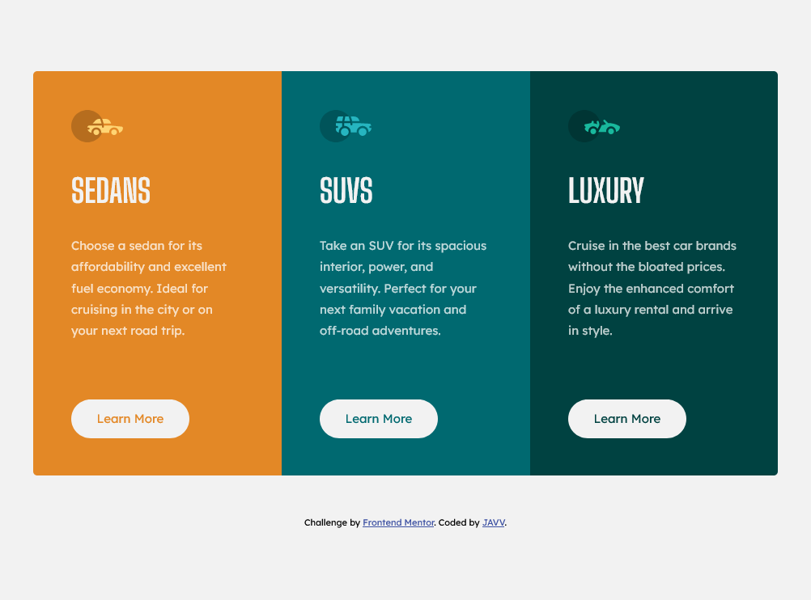
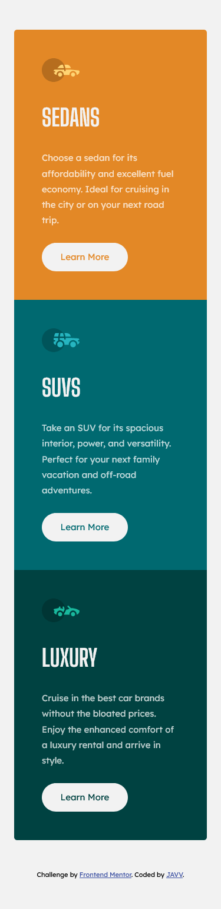

# Frontend Mentor - 3-column preview card component


## Welcome! 👋

Hello everyone, welcome to my repository 😁! This is my solution to the [3-column preview card component challenge on Frontend Mentor](https://www.frontendmentor.io/challenges/3column-preview-card-component-pH92eAR2-).

## Table of contents

- [Overview](#overview)
  - [The challenge](#the-challenge)
  - [Screenshot](#screenshot)
  - [Links](#links)
- [My process](#my-process)
  - [Built with](#built-with)
  - [What I learned](#what-i-learned)
- [Author](#author)

## The challenge

Users should be able to:

- View the optimal layout depending on their device's screen size
- See hover states for interactive elements

### Screenshot




### Links

- Solution URL: [Github](https://github.com/daisukeeita/3-Column-Preview-Card-Component)
- Live Site URL: [3-Column Card Preview Component](https://daisukeeita.github.io/3-Column-Preview-Card-Component/)

## My process

### Built with

- Semantic HTML5 markup
- CSS custom properties
- Flexbox
- CSS Grid
- Mobile-first workflow

### What I learned

After what I encountered in the previous challenge, I need to observe the design and its given materials for me to make the preferrable design proposal.

What I noticed in while doing this challenge is that I don't have to use the `flexbox` or `grid` to modify the layout of the contents of the Card, especially in the Mobile-first workflow. I just need to changed its appearance based on the design given. 

```html
      <div class="card-preview-container__sedans-container">
        <div class="container">
          
  
          <span class="card-preview-container__sedans-container__sedan-name title">
            Sedans
          </span>
  
          <p class="card-prevew-container__sedans-container__sedan-description description">
            Choose a sedan for its affordability and excellent fuel economy. Ideal for cruising in the city 
            or on your next road trip.
          </p>
  
          <button class="card-preview-container__sedans-container__sedans-btn btn">Learn More</button>
        </div>
      </div>
```

```css
.card-preview-container {
    width: 327px;
    border-radius: 5px;
    margin-bottom: 50px;
    overflow: hidden;
}

.container {
    width: 233px;
}

.card-preview-container__sedans-container,
.card-preview-container__suv-container,
.card-preview-container__luxury-container {
    display: flex;
    justify-content: center;
    align-items: center;
    padding-block: 48px;
}

.card-preview-container__sedans-container {
    background-color: var(--primary-color-400);
}

.card-preview-container__suv-container {
    background-color: var(--secondary-color-400);
}

.card-preview-container__luxury-container {
    background-color: var(--secondary-color-700);
}
```

I also used same classnames to different contents that have the same appearance, like the `button` of the component.

```html
<button class="card-preview-container__sedans-container__sedans-btn btn">Learn More</button>
<button class="card-preview-container__suv-container__suv-btn btn">Learn More</button>  
<button class="card-preview-container__luxury-container__luxury-btn btn">Learn More</button>
```

```css
.btn {
    border: none;
    height: 48px;
    width: 146px;
    border-radius: 25px;
    font-family: var(--font-familly-lexendDeca);
    font-size: var(--font-size-300);
    background-color: var(--neutral-color-0);
    transition: all 300ms linear;
}

.btn:hover {
    border: 2px solid var(--neutral-color-0);
    color: var(--neutral-color-0);
}
```